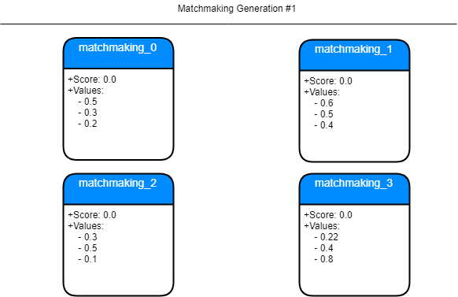
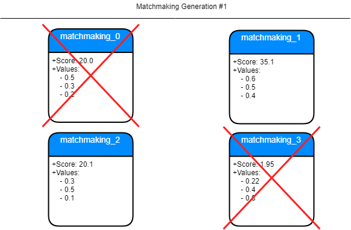

# Castle-Matchmaking

Matchmaking składa się z:

  * aplikacji Feedbacker
  * algorytmu analitycznego 

Feedbacker wraz z analityką odpowiada za proponowanie nowych rozwiązań matchmakingu i przekazanie do silnika gry. Pracuje na danych silnika gry (komponent analityczny)

Nowe rozwiązania są zapisane w postaci listy zmiennych typy *float* z przedziału od 0.0 do 1.0.

## Podstawowa struktura

Aplikacja zbudowana została na podstawie wzorca obiektowego Singleton, który posiada następujące elementy:
- Modułu konfiguracyjnego,
- Modułu zajmującego się procesem algorytmu genetycznego,
- Modułu połączenia HTTP,
- Modułu połączenia TCP,

Dodatkowo został zaimplementowany autorski algorytm ewolucyjny, który zgodnie z technikami optymalizacyjnymi pozwala na maksymalizację efektu. Utworzony algorytm zezwala na tworzenie metod oceny wyników za pomoca zadeklarowanej funkcji, która przyjmuje jako parametr listę zmiennych typu *float*, a zwraca pojedyńczą wartość typu *float*.

### Moduł konfiguracyjny

Jest to moduł, który pozwala na zarządzanie aplikacją za pomocą pliku konfiguracyjnego *config.cfg*. Plik ten ma strukturę następującą:
```
NAZWA_ATRYBUTU_1 = wartosc_1
#komentarz
#komentarz
NAZWA_ATRYBUTU_2 = wartosc_2
```

Aktualnie dostępne parametry:
- algorithmSavePath - określa położenie danych związanych z algorytmem genetycznym,
- population - [liczba całkowita] określa wielkość populacji algorytmu genetycznego,
- survive - [liczba zmiennoprzecinkowa] określa ile osobników populacji przejdzie do kolejnej generacji, jest liczbą z przedziału 0.0, a 1.0,
- mutation - [liczba zmiennoprzecinkowa] określa szansę na wystąpienie mutacji przy przechodzeniu do następnego pokolenia,
- values - [liczba calkowita] określa liczbę zmiennych, przypadających na jednego osobnika,

Moduł ten znajduje się w pliku *ConfigModule.cs*. Dodatkowo moduł ten korzysta z utworzonego wcześniej rozszerzenia klasy *String*, które jest zapisane w pliku *StringExtension.cs*, to rozszerzenie pozwala wyciągać parę (nazwa atrubutu, wartość atrybutu). 

### Moduł algorytmu genetycznego

Moduł ten ma za zadanie przechowywać, serializować i deserializować dane związane z algorytmem gentycznym. Moduł ten też pozwala serializować cała populację do obiektu typu JSON.

Aby móc korzystać z zalet wzorca *Singleton*, wymagane było opakowanie algorytmu genetycznego w moduł, którego kod znajduje się w pliku *EvolutionModule.cs*. Tak na prawdę jest on jedynie adapterem, do niezależnego kodu algorytmu genetycznego.

### Moduł połączenia HTTP

Jest to moduł nasłuchujący na porcie 6789. Pozwala on na pobieranie informacji o aktualnym stanie populacji algorytmu gentycznego. Dodatkowo, tylko przez ten moduł dochodzi do zewnętrznego oceniania każdego z osobników algorytmu genetycznego.

Połączenia HTTP są obsłużone w pliku *HTTPModule.cs*. Ten moduł nie korzysta z dodatkowych bibliotek zewnętrznych. A jedynie z wbudowanych w język C# obsługi żądań HTTP.

### Moduł połączenia TCP

Moduł połączenia TCP odpowiada za połączenie z GameInn Engine, to dzięki niemu dane docierają na serwer. Moduł ten pozwala na połączenie więcej niż jednego serwera. Dlatego też GameInn Engine może być skalowany.

Połączenia TCP są obsłużone w pliku *TCPModule.cs*. Ten moduł nie korzysta z dodatkowych bibliotek zewnętrznych. A jedynie z wbudowanych w język C# obsługi żądań TCP. Moduł ten działa w trybie nasłuchiwania, przez co oczekuje na połączenie się serwera gry. W momencie połączenia się serwera gry, następuje wysłanie informacji w formacie JSON, na temat aktualnie działającego matchmakingu. W momencie, gdy dojdzie do zmiany parametrów matchmakingu, moduł ten wyśle informację o tej zmianie do każdego połączonego z nim serwera gry.

## Algorytm genetyczny

W projekcie GameInn znalazł swoje zastosowanie algorytm genetyczny. Nie stanowi on elementu systemu rekomendacji, ze względu na to, że jego działanie jest bardzo losowe. Bardziej ten algorytm stanowi metodę poszukiwania najlepszego rozwiązania. 

W przeciwieństwie do innych metod uczenia maszynowego, zastosowanie algorytmu genetycznego pozwala na zdefiniowanie poszukiwanego rozwiązania za pomocą funkcji oceny. Stosowanie sieci neuronowej zakłada wykorzystanie wcześniej przygotowanej tablicy decyzyjnej, za pomocą której sieć się uczy. Algorytm genetyczny, bierze pod uwagę całą przestrzeń rozwiązań w celu znalezienia optymalnego rozwiązania.

### Etapy życia algorytmu genetycznego

1. Pierwszy etap polega na odtworzeniu brakujących członków w populacji algorytmu genetycznego. Jeżeli wcześniej populacja była pusta, utworzoni zostaną nowi członkowie populacji losując ich wewnętrzne wartości. W przeciwnym razie dojdzie do krzyżowania się pomiędzy istniejącymi członkami populacji. Krzyżowanie polega na wyciągnięciu średniej z tych samych wartości, dwóch wybranych członków populacji. Następnie nowo utworzony twór, zostaje poddany mutacji, podczas której niektóre wartości elementu mogą zostać zastąpione losową wartością.


2. Algorytm oczekuje na informacje o ocenie aktualnej populacji, po otrzymaniu tej informacji, następuje jej przypisanie do każdego członka populacji.


3. Ostatnim etapem jest wybranie najlepszych członków populacji, aby przeszli do kolejnej generacji. Niewybrani członkowie, przestają istnieć, a na ich miejsce w kolejnym przebiegu zostaną utworzeni nowi członkowie. Po tym etapie, rozpoczyna się nowa generacja i cykl życia algorytmu genetycznego.


## Deploy

Aby dokonać deploy'u należy pobrać pliki z repozytorium:

```
https://github.com/Incuvo/castle-matchmaking
```

Aby dokonać uruchomienia serwera należy w folderze projektu użyć komendy:
```
dotnet run
```

Jeżeli z jakiegoś powodu komenda ta nie sprawdzi i pobierze potrzebnych bibliotek, należy użyć wcześniej komendy:
```
dotnet restore
```

## FAQ

1. **Jak usunąć aktualną populację algorytmu genetycznego?**

    Należy usunąć folder określony pod parametrem 'algorithmSavePath'.

2. **Jak przesłać za pomocą protokołu HTTP ocenę populacji algorytmu genetycznego.**

    Aby przesłać ocenę, należy wysłać dane, używając metodę 'POST', na adres hosta **/score*. Wysyłane dane muszą mieć następującą strukturę JSON:
    ```
    {
        matchmaking:
        [
                {name: "IDENTYFIKATOR GRUPY 1", score: WARTOŚĆ LICZBOWA 1},
                {name: "IDENTYFIKATOR GRUPY 2", score: WARTOŚĆ LICZBOWA 2}
        ]
    }
    ```
3. **Czy istnieje jakikolwiek monitoring czy logowanie serwera?**

    Możliwe jest jedynie sprawdzenie aktualnych wartości matchmakingu, wysyłająć żądanie HTTP na adres **/algorithms*
